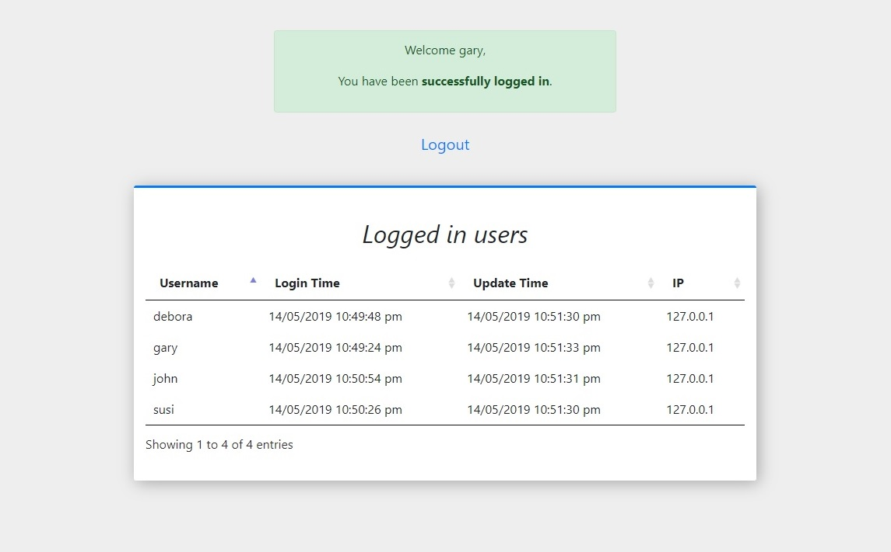

# LoginProject

LoginProject is a simple and secure login which does the following:
1) Display a login form with user credentials
2) Successful login displays a page which contains the following:\
Welcome message\
Logout option\
Report of all the current conntected users

User Properties:
- username
- salt            - Used for password encryption
- password - Hash result for user's original plain password and its random salt 
- update_time     - Every three seconds a client sent a heartbeat. The update_time property contains the last heartbeat time.
- login_time      - Last login time
- ip              - Client IP 

The code is built with PHP, jQuery and Bootstrap for the form design.\
DataTable plug-in is used to display the connected users table. \
File system is used as user repository.

## Installation
Prerequisites:
- Install XAMPP 1.8.0 from https://sourceforge.net/projects/xampp/files/ \
  It installs PHP 5.4

## Setup
This project provides an out of the box user repository which contains 10 users.\
In order to change user's credentials follow these steps:
1. Delete all json files under the db directory.
2. Update the file LoginProject/php/addusers.php with a new repository.
3. Browse to https://web_server_host/LoginProject/php/addusers.php which will populate the repository.

Note:\
For production environment you should remove addusers.php file from your project.

The addusers.php script creates the following credentials (username,password):
- gary,KAEYZwZxi 
- marius,i8HhO4SDR 
- debora,f7L199xe 
- kevin,t9Dc2lHpvq 
- alica,D0sXeQdMk9o9 
- susi,ptVtLOPIA 
- riki,HeNUgv 
- alaster,rIxKmov50 
- mark,aCSiCD 
- john,wMpHJwmdF9Dr 

Valid credentials: 
- username - Alphanumeric and _ 
- password - Alphanumeric 

## Login
Browse to https://web_server_host/LoginProject 

Use one of the above 10 credentials. 

Wrong credentials => Displays error messages \
Successful login => Redirects to https://web_server_host/LoginProject/php/connected.php 

## Connected users - connected.php
Displays all current connected users in a table. \
This table is being updated every 3 seconds. 

When a user is connected, a heartbeat is sent from the client every 3 seconds using an AJAX call. \
User's 'update_time' property is updated in each heartbeat. \
In case user's 'update_time' property is not updated more than 3 seconds the user is considered as not connected. 

## Security
- SSL is supported. 
- /LoginProject/php/connected.php is authorized only for users who signed in successfully. 
- Unauthroized session are permitted to access only the login page. 
- Passwords are never kept as plain text. They are hashed with a random different salt per user. 
- The salt and the hashed value never leave the backend, i.e. the client is not exposed to this sensitive data. 
- Wrong user credentials display a vague error message intentially to harden the dictionary attack.
- Create .htaccess file under the DB directory in order to prevent access to the DB directory.

 
